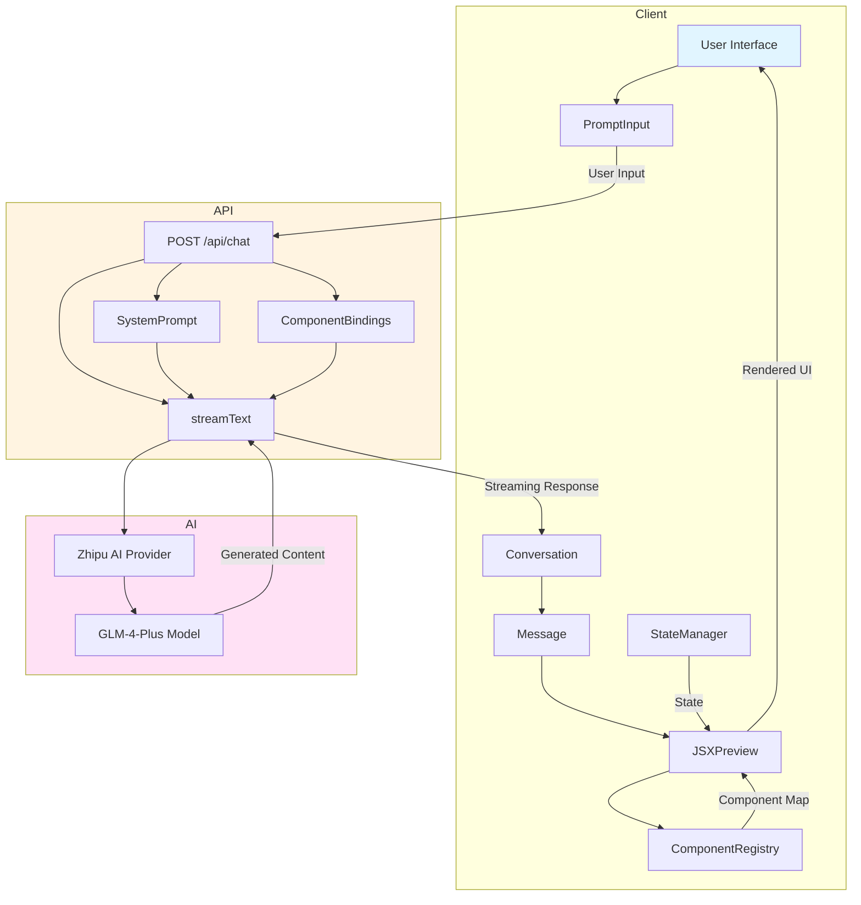
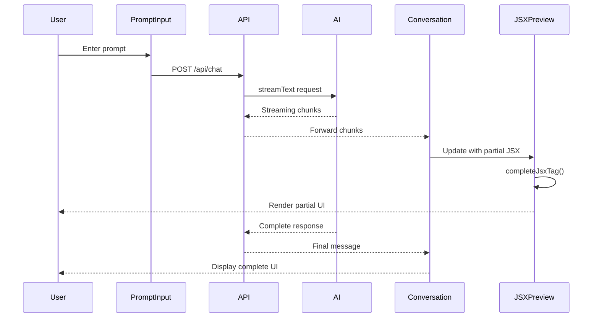
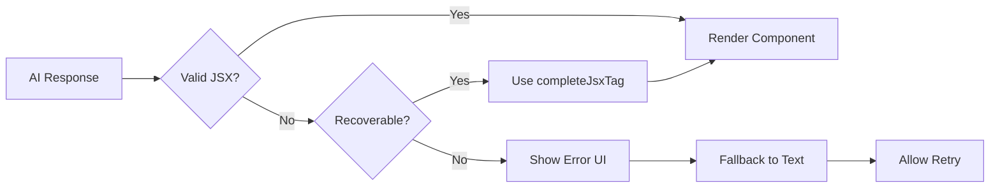

# Generative UI Architecture for v0-clone

## Table of Contents
1. [Overview](#overview)
2. [Architecture Diagram](#architecture-diagram)
3. [API Layer Design](#api-layer-design)
4. [State Management](#state-management)
5. [Component Integration](#component-integration)
6. [Data Flow](#data-flow)
7. [System Prompts](#system-prompts)
8. [Error Handling](#error-handling)
9. [Implementation Roadmap](#implementation-roadmap)

---

## Overview

This architecture defines a comprehensive generative UI system for the v0-clone Next.js application. The system enables AI to generate, modify, and render React components dynamically through natural language conversation.

### Key Technologies
- **Next.js 16.1.6** - React framework with App Router
- **React 19.2.3** - UI library
- **Vercel AI SDK 6.0.77** - AI integration with streaming support
- **react-jsx-parser** - Dynamic JSX parsing and rendering
- **Zhipu AI** - Primary AI provider (glm-4-plus model)
- **TypeScript** - Type safety

### Core Capabilities
1. **Streaming Responses** - Real-time text and UI component generation
2. **Component Registry** - Mapped AI component names to actual React components
3. **Conversation History** - Persistent context across interactions
4. **UI State Management** - Track and update UI state between generations
5. **Error Recovery** - Graceful handling of invalid/incomplete JSX

---

## Architecture Diagram



---

## API Layer Design

### API Endpoint Specification

#### POST `/api/chat`

**Purpose**: Handle chat requests with streaming support for both text and UI components.

**Request Body**:
```typescript
interface ChatRequest {
  messages: Array<{
    role: 'user' | 'assistant' | 'system';
    content: string;
    uiState?: Record<string, any>; // Optional UI state from previous turns
  }>;
  model?: string; // Optional model override (default: ZHIPU_MODEL)
  stream?: boolean; // Enable streaming (default: true)
  uiContext?: {
    availableComponents: string[]; // List of available component names
    currentState?: Record<string, any>; // Current UI state
  };
}
```

**Response**: Streaming response using Vercel AI SDK's `streamText`

**Implementation**:

```typescript
// app/api/chat/route.ts
import { streamText } from 'ai';
import { createZhipu } from 'zhipu-ai-provider';
import { getSystemPrompt } from '@/lib/prompts';
import { getComponentBindings } from '@/lib/component-registry';

export async function POST(req: Request) {
  const { messages, model, stream = true, uiContext } = await req.json();

  // Configure Zhipu provider
  const zhipu = createZhipu({
    baseURL: process.env.ZHIPU_BASE_URL,
    apiKey: process.env.ZHIPU_API_KEY,
  });
  const modelName = model || process.env.ZHIPU_MODEL || 'glm-4-plus';

  // Get system prompt with component library documentation
  const systemPrompt = getSystemPrompt(uiContext?.availableComponents);

  // Get component bindings for UI state
  const bindings = getComponentBindings(uiContext?.currentState);

  if (stream) {
    // Streaming response
    const result = streamText({
      model: zhipu(modelName),
      system: systemPrompt,
      messages,
      temperature: 0.7,
      maxTokens: 4000,
      experimental_continueSteps: 5, // Continue incomplete JSX
      experimental_telemetry: { isEnabled: true },
    });

    return result.toDataStreamResponse();
  } else {
    // Non-streaming fallback
    const result = await generateText({
      model: zhipu(modelName),
      system: systemPrompt,
      messages,
      temperature: 0.7,
      maxTokens: 4000,
    });

    return NextResponse.json({ content: result.text });
  }
}
```

### Response Format

The AI response will contain mixed content:
- **Plain text** - Conversational responses
- **Code blocks** - JSX components wrapped in triple backticks with `jsx` or `tsx` language
- **UI directives** - Special markers for UI state updates

Example response format:
```typescript
interface AIResponse {
  type: 'text' | 'jsx' | 'ui-update';
  content: string;
  metadata?: {
    componentName?: string;
    stateUpdates?: Record<string, any>;
  };
}
```

---

## State Management

### Conversation State

```typescript
// lib/types/conversation.ts
export interface ConversationMessage {
  id: string;
  role: 'user' | 'assistant' | 'system';
  content: string;
  timestamp: number;
  uiComponents?: {
    id: string;
    jsx: string;
    componentName: string;
    state?: Record<string, any>;
  }[];
}

export interface ConversationState {
  messages: ConversationMessage[];
  uiState: Record<string, any>;
  isLoading: boolean;
  error: Error | null;
}
```

### State Management Strategy

Using React Context + Hooks pattern for conversation state:

```typescript
// lib/hooks/use-conversation.ts
import { create } from 'zustand';

interface ConversationStore {
  messages: ConversationMessage[];
  uiState: Record<string, any>;
  isLoading: boolean;
  error: Error | null;
  
  // Actions
  addMessage: (message: ConversationMessage) => void;
  updateMessage: (id: string, updates: Partial<ConversationMessage>) => void;
  setUIState: (state: Record<string, any>) => void;
  setLoading: (loading: boolean) => void;
  setError: (error: Error | null) => void;
  clearConversation: () => void;
}

export const useConversationStore = create<ConversationStore>((set) => ({
  messages: [],
  uiState: {},
  isLoading: false,
  error: null,
  
  addMessage: (message) =>
    set((state) => ({
      messages: [...state.messages, message],
    })),
  
  updateMessage: (id, updates) =>
    set((state) => ({
      messages: state.messages.map((msg) =>
        msg.id === id ? { ...msg, ...updates } : msg
      ),
    })),
  
  setUIState: (newState) =>
    set((state) => ({
      uiState: { ...state.uiState, ...newState },
    })),
  
  setLoading: (isLoading) => set({ isLoading }),
  setError: (error) => set({ error }),
  clearConversation: () => set({
    messages: [],
    uiState: {},
    isLoading: false,
    error: null,
  }),
}));
```

### UI State Tracking

```typescript
// lib/types/ui-state.ts
export interface UIComponentState {
  id: string;
  componentName: string;
  props: Record<string, any>;
  children?: UIComponentState[];
}

export interface GlobalUIState {
  components: Map<string, UIComponentState>;
  activeComponentId: string | null;
  theme: 'light' | 'dark';
}
```

---

## Component Integration

### Component Registry Pattern

```typescript
// lib/component-registry/index.ts
import * as UIComponents from '@/components/ui';

// Map AI-friendly names to actual components
export const COMPONENT_REGISTRY = {
  // Basic UI components
  'Button': UIComponents.Button,
  'Card': UIComponents.Card,
  'Badge': UIComponents.Badge,
  'Input': UIComponents.Input,
  'Textarea': UIComponents.Textarea,
  'Select': UIComponents.Select,
  'Tabs': UIComponents.Tabs,
  'Dialog': UIComponents.Dialog,
  'Progress': UIComponents.Progress,
  'Spinner': UIComponents.Spinner,
  'Alert': UIComponents.Alert,
  'Avatar': UIComponents.Avatar,
  'Accordion': UIComponents.Accordion,
  'Carousel': UIComponents.Carousel,
  'Collapsible': UIComponents.Collapsible,
  'DropdownMenu': UIComponents.DropdownMenu,
  'HoverCard': UIComponents.HoverCard,
  'Popover': UIComponents.Popover,
  'ScrollArea': UIComponents.ScrollArea,
  'Separator': UIComponents.Separator,
  'Switch': UIComponents.Switch,
  'Tooltip': UIComponents.Tooltip,
  
  // AI-specific components
  'JSXPreview': () => import('@/components/ai-elements/jsx-preview').then(m => m.JSXPreview),
  'CodeBlock': () => import('@/components/ai-elements/code-block').then(m => m.CodeBlock),
  'Artifact': () => import('@/components/ai-elements/artifact').then(m => m.Artifact),
  'Canvas': () => import('@/components/ai-elements/canvas').then(m => m.Canvas),
};

// Get component documentation for system prompt
export function getComponentDocumentation(): string {
  const docs: string[] = [];
  
  for (const [name, component] of Object.entries(COMPONENT_REGISTRY)) {
    // Extract props from component if possible
    docs.push(`### ${name}`);
    docs.push(`- Type: ${typeof component === 'function' ? 'Component' : 'Async Component'}`);
    docs.push('');
  }
  
  return docs.join('\n');
}

// Get component bindings for react-jsx-parser
export function getComponentBindings(bindings?: Record<string, any>) {
  return {
    ...COMPONENT_REGISTRY,
    ...bindings,
  };
}
```

### JSX Parsing and Rendering

The existing [`JSXPreview`](components/ai-elements/jsx-preview.tsx) component handles dynamic JSX rendering with:
- Streaming support via [`completeJsxTag()`](components/ai-elements/jsx-preview.tsx:74) function
- Error handling with [`JSXPreviewError`](components/ai-elements/jsx-preview.tsx:221)
- Component bindings support
- Context for state management

### Integration with Chat Flow

```typescript
// components/ai-elements/generative-message.tsx
import { JSXPreview, JSXPreviewContent, JSXPreviewError } from './jsx-preview';
import { useConversationStore } from '@/lib/hooks/use-conversation';
import { getComponentBindings } from '@/lib/component-registry';

interface GenerativeMessageProps {
  content: string;
  isStreaming?: boolean;
}

export function GenerativeMessage({ content, isStreaming }: GenerativeMessageProps) {
  const { uiState } = useConversationStore();
  
  // Extract JSX from markdown code blocks
  const jsxContent = extractJSXFromContent(content);
  const textContent = extractTextFromContent(content);
  
  const bindings = getComponentBindings(uiState);
  
  return (
    <div className="generative-message">
      {textContent && <div className="text-content">{textContent}</div>}
      {jsxContent && (
        <JSXPreview jsx={jsxContent} isStreaming={isStreaming} bindings={bindings}>
          <JSXPreviewContent />
          <JSXPreviewError />
        </JSXPreview>
      )}
    </div>
  );
}

// Helper functions
function extractJSXFromContent(content: string): string {
  const jsxMatch = content.match(/```(?:jsx|tsx)\n([\s\S]*?)```/);
  return jsxMatch ? jsxMatch[1] : '';
}

function extractTextFromContent(content: string): string {
  return content.replace(/```(?:jsx|tsx)\n[\s\S]*?```/g, '').trim();
}
```

### Streaming JSX Handling

The existing [`completeJsxTag()`](components/ai-elements/jsx-preview.tsx:74) function handles incomplete JSX during streaming by:
1. Tracking open tag stack
2. Auto-closing unclosed tags
3. Preserving partial content

---

## Data Flow

### Request Flow



### Message Processing Pipeline

```typescript
// lib/pipelines/message-processor.ts
import { streamText } from 'ai';
import { parseAIResponse } from './parsers/ai-response-parser';
import { extractUIComponents } from './parsers/ui-component-extractor';
import { updateUIState } from './state/ui-state-updater';

export async function processMessageStream(
  messages: ConversationMessage[],
  onChunk: (chunk: AIResponseChunk) => void,
  onComplete: (message: ConversationMessage) => void
) {
  const response = await streamText({
    model: zhipu(process.env.ZHIPU_MODEL),
    messages: messages.map(m => ({
      role: m.role,
      content: m.content,
    })),
  });

  let accumulatedContent = '';
  let uiComponents: UIComponent[] = [];

  for await (const chunk of response.textStream) {
    accumulatedContent += chunk;
    
    // Parse accumulated content
    const parsed = parseAIResponse(accumulatedContent);
    const extractedUI = extractUIComponents(accumulatedContent);
    
    if (extractedUI.length > 0) {
      uiComponents = extractedUI;
    }
    
    // Emit chunk
    onChunk({
      type: parsed.type,
      content: parsed.content,
      isComplete: false,
      uiComponents,
    });
  }

  // Final message
  const finalMessage: ConversationMessage = {
    id: generateId(),
    role: 'assistant',
    content: accumulatedContent,
    timestamp: Date.now(),
    uiComponents,
  };

  onComplete(finalMessage);
}
```

### Error Handling Flow



---

## System Prompts

### Base System Prompt

```typescript
// lib/prompts/system-prompt.ts
export function getSystemPrompt(availableComponents?: string[]): string {
  const componentList = availableComponents?.join(', ') || 'standard UI components';
  
  return `You are an expert UI/UX designer and React developer. Your task is to help users create beautiful, functional user interfaces through conversation.

## Your Capabilities

1. **Generate React/JSX Components**: Create valid React components using the available component library.
2. **Explain Design Decisions**: Provide clear explanations for your UI choices.
3. **Iterative Refinement**: Modify and improve existing UI based on user feedback.
4. **Responsive Design**: Ensure components work across different screen sizes.

## Component Library

You have access to these components: ${componentList}

## Response Format

When generating UI components:
1. Wrap JSX code in triple backticks with \`jsx\` or \`tsx\` language identifier
2. Provide a brief explanation before the code
3. Use descriptive component names
4. Include proper TypeScript types where applicable

Example:
\`\`\`jsx
<Button variant="primary" onClick={handleClick}>
  Click me
</Button>
\`\`\`

## Best Practices

- Use Tailwind CSS classes for styling
- Ensure accessibility (ARIA labels, keyboard navigation)
- Handle loading and error states
- Keep components focused and reusable
- Use semantic HTML where possible

## Current Context

The user is building a ${getCurrentProjectContext()}.

Remember: Your goal is to create interfaces that are both beautiful and functional. Always consider the user's intent and provide thoughtful solutions.
`;
}
```

### Component-Specific Prompts

```typescript
// lib/prompts/component-prompts.ts
export const COMPONENT_INSTRUCTIONS = {
  Button: `
### Button Component
Props:
- variant: 'default' | 'destructive' | 'outline' | 'secondary' | 'ghost' | 'link'
- size: 'default' | 'sm' | 'lg' | 'icon'
- disabled: boolean
- onClick: function

Usage: <Button variant="primary" size="lg">Click me</Button>
`,

  Card: `
### Card Component
Structure:
- Card (container)
  - CardHeader
    - CardTitle
    - CardDescription
  - CardContent
  - CardFooter

Usage:
<Card>
  <CardHeader>
    <CardTitle>Title</CardTitle>
    <CardDescription>Description</CardDescription>
  </CardHeader>
  <CardContent>Content here</CardContent>
</Card>
`,

  Input: `
### Input Component
Props:
- type: 'text' | 'email' | 'password' | 'number'
- placeholder: string
- disabled: boolean
- value: string
- onChange: function

Usage: <Input type="text" placeholder="Enter text" />
`,

  // ... more component instructions
};
```

### UI State Management Prompt

```typescript
// lib/prompts/state-prompt.ts
export function getStateManagementPrompt(currentState: Record<string, any>): string {
  return `
## UI State Management

Current UI State:
\`\`\`json
${JSON.stringify(currentState, null, 2)}
\`\`\`

When you need to update UI state, include a state directive after your JSX:

\`\`\`json
{
  "type": "ui-update",
  "updates": {
    "componentId": "new-state-value"
  }
}
\`\`\`

This allows the UI to maintain state across generations.
`;
}
```

---

## Error Handling

### Error Types

```typescript
// lib/types/errors.ts
export enum GenerativeUIErrorType {
  INVALID_JSX = 'INVALID_JSX',
  INCOMPLETE_RESPONSE = 'INCOMPLETE_RESPONSE',
  COMPONENT_NOT_FOUND = 'COMPONENT_NOT_FOUND',
  API_ERROR = 'API_ERROR',
  PARSING_ERROR = 'PARSING_ERROR',
}

export class GenerativeUIError extends Error {
  constructor(
    public type: GenerativeUIErrorType,
    message: string,
    public recoverable: boolean = true,
    public originalError?: Error
  ) {
    super(message);
    this.name = 'GenerativeUIError';
  }
}
```

### Error Recovery Strategies

```typescript
// lib/error-handling/recovery.ts
export function handleGenerativeUIError(
  error: GenerativeUIError,
  context: RecoveryContext
): RecoveryAction {
  switch (error.type) {
    case GenerativeUIErrorType.INVALID_JSX:
      return {
        action: 'retry_with_correction',
        correction: 'Please provide valid JSX syntax',
      };
    
    case GenerativeUIErrorType.INCOMPLETE_RESPONSE:
      return {
        action: 'continue_generation',
        continueFrom: context.lastChunk,
      };
    
    case GenerativeUIErrorType.COMPONENT_NOT_FOUND:
      return {
        action: 'substitute_component',
        substitute: findClosestComponent(error.message),
      };
    
    case GenerativeUIErrorType.API_ERROR:
      return {
        action: 'fallback_to_text',
        message: 'I encountered an error. Let me try again.',
      };
    
    default:
      return {
        action: 'show_error',
        message: error.message,
      };
  }
}
```

### Error UI Component

```typescript
// components/ai-elements/error-boundary.tsx
export function GenerativeUIErrorBoundary({
  error,
  onRetry,
  onFallback,
}: {
  error: GenerativeUIError;
  onRetry?: () => void;
  onFallback?: () => void;
}) {
  return (
    <div className="generative-error">
      <AlertCircle className="error-icon" />
      <div className="error-content">
        <h3>Something went wrong</h3>
        <p>{error.message}</p>
        {error.recoverable && (
          <div className="error-actions">
            {onRetry && (
              <Button onClick={onRetry} variant="outline">
                Try Again
              </Button>
            )}
            {onFallback && (
              <Button onClick={onFallback} variant="ghost">
                Show as Text
              </Button>
            )}
          </div>
        )}
      </div>
    </div>
  );
}
```

---

## Implementation Roadmap

### Phase 1: Core API Enhancement
- [ ] Update [`app/api/chat/route.ts`](app/api/chat/route.ts) to use `streamText`
- [ ] Implement system prompt generation
- [ ] Add component bindings to API response
- [ ] Set up streaming response handling

### Phase 2: State Management
- [ ] Create Zustand store for conversation state
- [ ] Implement UI state tracking
- [ ] Add message persistence (localStorage/IndexedDB)
- [ ] Create state management hooks

### Phase 3: Component Integration
- [ ] Complete component registry implementation
- [ ] Create component documentation generator
- [ ] Implement JSX extraction from markdown
- [ ] Build GenerativeMessage component

### Phase 4: UI Updates
- [ ] Update [`app/page.tsx`](app/page.tsx) to use new architecture
- [ ] Integrate streaming with [`Conversation`](components/ai-elements/conversation.tsx)
- [ ] Connect [`PromptInput`](components/ai-elements/prompt-input.tsx) to new API
- [ ] Update [`JSXPreview`](components/ai-elements/jsx-preview.tsx) usage

### Phase 5: Error Handling
- [ ] Implement error boundary
- [ ] Add recovery strategies
- [ ] Create error UI components
- [ ] Add retry mechanisms

### Phase 6: Testing & Refinement
- [ ] Test streaming with various prompts
- [ ] Test error scenarios
- [ ] Optimize performance
- [ ] Add loading states

---

## File Structure

```
v0-clone/
├── app/
│   ├── api/
│   │   └── chat/
│   │       └── route.ts              # Enhanced streaming API
│   └── page.tsx                      # Main chat interface
├── components/
│   ├── ai-elements/
│   │   ├── conversation.tsx          # Existing
│   │   ├── jsx-preview.tsx           # Existing
│   │   ├── message.tsx               # Existing
│   │   ├── prompt-input.tsx          # Existing
│   │   ├── generative-message.tsx    # NEW: Message with JSX
│   │   └── error-boundary.tsx        # NEW: Error handling
│   └── ui/                           # Existing UI components
├── lib/
│   ├── component-registry/
│   │   ├── index.ts                  # Component mapping
│   │   └── documentation.ts          # Component docs generator
│   ├── hooks/
│   │   └── use-conversation.ts       # Conversation state hook
│   ├── prompts/
│   │   ├── system-prompt.ts          # Base system prompt
│   │   ├── component-prompts.ts      # Component instructions
│   │   └── state-prompt.ts           # State management prompt
│   ├── types/
│   │   ├── conversation.ts          # Conversation types
│   │   ├── ui-state.ts               # UI state types
│   │   └── errors.ts                 # Error types
│   ├── pipelines/
│   │   └── message-processor.ts      # Message processing
│   ├── parsers/
│   │   ├── ai-response-parser.ts     # Response parsing
│   │   └── ui-component-extractor.ts # JSX extraction
│   ├── state/
│   │   └── ui-state-updater.ts       # State updates
│   └── error-handling/
│       └── recovery.ts               # Error recovery
└── plans/
    └── generative-ui-architecture.md  # This document
```

---

## Notes

1. **Streaming Priority**: The system prioritizes streaming responses for real-time feedback, but maintains fallback to non-streaming for compatibility.

2. **Component Safety**: All dynamically rendered components should be validated against the component registry to prevent XSS attacks.

3. **State Persistence**: Consider implementing conversation persistence for better user experience.

4. **Performance**: The [`JSXPreview`](components/ai-elements/jsx-preview.tsx) component already handles streaming efficiently with the [`completeJsxTag()`](components/ai-elements/jsx-preview.tsx:74) function.

5. **Extensibility**: The component registry pattern allows easy addition of new components without modifying core logic.

6. **Multi-Provider Support**: The architecture supports switching between AI providers (Zhipu, OpenAI, Anthropic, Google) through environment configuration.
